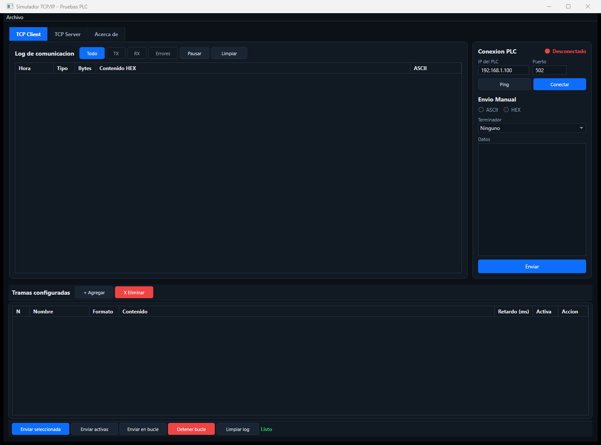
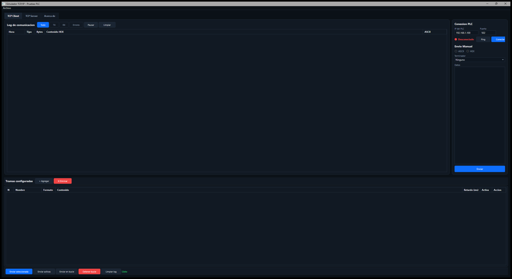

# Simulador TCP/IP - Pruebas PLC

Aplicacion de escritorio para simular conexiones TCP/IP y probar comunicacion con PLCs y otros dispositivos industriales. Permite enviar y recibir tramas en formato ASCII o HEX, gestionar conexiones cliente/servidor, y configurar tramas predefinidas para pruebas automatizadas.

## Interfaz

### TCP Client - Vista normal

### TCP Client - Vista maximizada

## Caracteristicas

- **TCP Client**: Conectarse a cualquier dispositivo TCP/IP (PLC, servidor, etc.)
- **TCP Server**: Escuchar conexiones entrantes y responder tramas
- **Log de comunicacion**: Registro visual de todas las tramas TX/RX con timestamp, tipo, bytes y contenido HEX/ASCII
- **Tramas configuradas**: Guardar tramas predefinidas con nombre, formato, contenido y retardo
- **Envio manual**: Enviar datos en ASCII o HEX con terminadores configurables (CR, LF, CRLF, STXETX). HEX acepta formato con espacios (`0A 0B 0C`) o contiguo (`0A0B0C`)
- **Tema oscuro industrial**: Diseño profesional con fondo oscuro, paneles gris carbon, acentos azules y verdes

## Tecnologias

- **Framework**: .NET 8
- **UI**: WPF (Windows Presentation Foundation)
- **Lenguaje**: C#
- **Plataforma**: Windows

## Descarga

Descarga la ultima version portable desde la seccion [Releases](https://github.com/QwertyMH/TCP-Frame-Tester/releases).

## Uso

1. Ejecuta `SimuladorTCP.exe`
2. Selecciona la pestana **TCP Client** o **TCP Server**
3. Configura la IP y el puerto del dispositivo
4. Haz clic en **Conectar**
5. Usa el panel de **Envio Manual** para enviar tramas o agrega tramas configuradas para pruebas automatizadas

## Requisitos

- Windows 10/11
- No requiere instalacion de .NET Runtime (version self-contained)

## Licencia

MIT License
